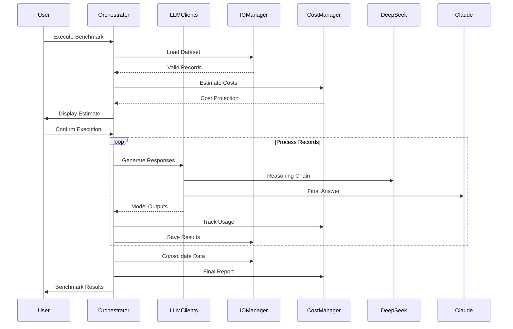
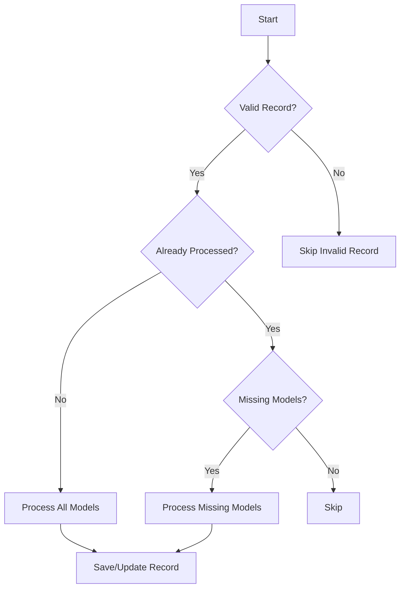
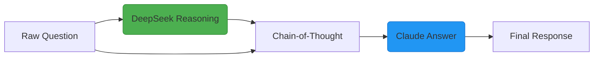

# LLM Reasoning-Augmented Benchmark Framework

**Empirical Evaluation of Hybrid AI Architectures**  
*Comparing Standalone vs Reasoning-Augmented LLM Approaches*
Focused on Claude Sonnet 3.5 20241022 and DeepSeek R1


## Architecture Overview



## Record Processing Flow



## Installation & Configuration

```bash
git clone https://github.com/yourusername/llm-reasoning-benchmark
cd llm-reasoning-benchmark
python3 -m venv .venv && source .venv/bin/activate
pip install -r requirements.txt

# Configure API keys
cp .env.example .env
nano .env  # Add DEEPSEEK_API_KEY and ANTHROPIC_API_KEY etc
```

## Model Configuration (`config.json`)
```json
{
    "models": [
        {
            "model_key": "deepseek_reasoner",
            "model_name": "deepseek-reasoner",
            "display_name": "DeepSeek R1",
            "token_groups": [{
                "type": "single",
                "input": "input",
                "output": "output"
            }]
        },
        {
            "model_key": "claude_sonnet",
            "model_name": "claude-3-5-sonnet-20241022",
            "token_groups": [
                {
                    "type": "grouped",
                    "label": "Standalone"
                },
                {
                    "type": "grouped",
                    "label": "With Reasoning"
                }
            ]
        }
    ]
}
```

## Execution Workflow

1. **Dataset Preparation**
```python
from dataset import GPQADataset
dataset = GPQADataset()
prompt = dataset.get_formatted_prompt(question_data)
```

2. **Run Benchmark**
```bash
python main.py --max-samples 100
```

3. **Sample Output**
```
=== Cost Estimate ===
DeepSeek Reasoner: $0.89
Claude Sonnet (Standalone): $2.31 
Claude Sonnet (With Reasoning): $3.45

Processing: 100%|██████████| 100/100 [12:45<00:00, 7.65s/it]
🎯 Benchmark Complete
📦 Processed: 100 ❌ Errors: 2
💰 Actual Costs:
  Claude Sonnet (Standalone): $2.4123
  Claude Sonnet (With Reasoning): $3.5021
  Total Cost: $6.7945
```

## Results Schema

```json
{
    "record_id": "q_185",
    "question": "What is the capital of France?",
    "correct_answer": "Paris",
    "metadata": {
        "difficulty": "Hard",
        "high_level_domain": "Geography",
        "subdomain": "European Capitals"
    },
    "token_usage": {
        "deepseek_reasoner": {"input": 154, "output": 89},
        "claude_sonnet_standalone": {"input": 169, "output": 45},
        "claude_sonnet_with_reasoning": {"input": 323, "output": 62}
    },
    "costs": {
        "total": 0.0679,
        "deepseek_reasoner": 0.0021,
        "claude_sonnet_standalone": 0.0241,
        "claude_sonnet_with_reasoning": 0.0417
    }
}
```


## Hybrid Pipeline Benefits



## License
MIT Licensed - See [LICENSE](LICENSE)  
*Architecture designed for reproducible LLM evaluation*
